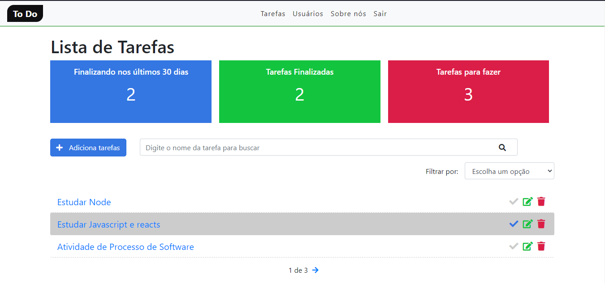

<h3 align="center">
    <b style = "color: green";>ToDo</b>
    <br><br>
    <b> Plataforma para gerenciamento de Tarefas Pessoais!</b>  
    <br>
</h3>


# Índice

- [Sobre](#sobre)
- [LICENSE](#license)
- [Tecnologias Utilizadas](#tecnologias-utilizadas)
- [Como Usar](#como-usar)
- [Como Contribuir](#como-contribuir)

<a id="sobre"></a>


## :bookmark: Sobre

	
O <strong>ToDo</strong> é uma aplicação Web voltada para ajudar pessoas no gerenciamento de tarefas pessoais.

Essa aplicação foi construída na trilha de <strong>Matheu Battisti</strong> no <strong>Youtube</strong> distribuída no canal [HoraDeCodar](https://www.youtube.com/watch?v=93sDfZn89nM&list=PLnDvRpP8BnewqnMzRnBT5LeTpld5bMvsj&index=20&ab_channel=MatheusBattisti-HoradeCodar). A ideia de criar uma aplicação voltada para o gerenciamento de tarefas surgiu da necessidades que muitos DEV ter muitos projetos pra entregar no prazos, essa agenda auxilia nas entregas e no que deve ser feito, funciona como um controle e gerenciamento do tempo.
<a id="documentacao"></a>

## :books: Documentação


<a id="tecnologias-utilizadas"></a>

## :rocket: Tecnologias Utilizadas

O projeto foi desenvolvido utilizando as seguintes tecnologias

- [Html](https://developer.mozilla.org/pt-BR/docs/Aprender/HTML/Introducao_ao_HTML)
- [Bootstrap](https://getbootstrap.com/docs/5.0/getting-started/introduction/)
- [Django](https://docs.djangoproject.com/en/3.1/)
- [Sqlite](https://sqlite.org/docs.html)


## :heavy_check_mark: :computer: Resultado Web

<h1 align="center">
    
</h1>

<a id="como-usar"></a>.

## :fire: Como usar

- ### **Pré-requisitos**

  - É **necessário** possuir o **[Python](https://www.python.org/)** instalado na máquina

  

1. Faça um clone :

```sh
  $ git clone https://github.com/Rafael-Rufino/Projeto-ToDo.git

```

2. Executando a Aplicação:

```sh
  # Instale as dependências
  $ python -m pip install Django


  ## Crie o banco de dados
  $ cd projeto-django3/todo
  #gerar o codigo sql
  $ python manage.py makemigrate
  #migrar o codigo sql pra o bando de dados 
  $ python manage.py migrate


  # Inicie a aplicação web
  $ cd projeto-django3/todo
  $ python manage.py runserver


  
  # Acessar o Servidor no Navegador
  $ http://127.0.0.1:3000/
 
  # Porta de Acesso Liberado
  $ 3000


```


## :recycle: Como contribuir

- Faça um Fork desse repositório,
- Crie uma branch com a sua feature: `git checkout -b my-feature`
- Commit suas mudanças: `git commit -m 'feat: My new feature'`
- Push a sua branch: `git push origin my-feature`


🎓 **Quem ministrou?**

As aulas foram ministradas pelo mestre Matheus Battisti - Instructor - horaDeCodar.

📝 **License**

Esse projeto está sob a licença MIT. Veja o arquivo [LICENSE](LICENSE.md) para mais detalhes.


<h4 align="center">
    Feito com 💜 by <a href="https://www.linkedin.com/in/rafael-r-dos-santos-b889311ba/" target="_blank">Rafael Rufino</a>
</h4>


